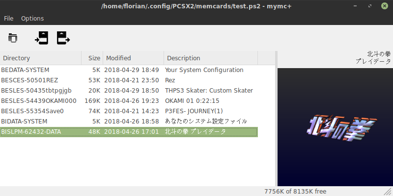

# mymc+

[](https://travis-ci.org/thestr4ng3r/mymcplus)

mymc+ is a PlayStation 2 memory card manager for to be used with
.ps2 images as created by the PCSX2 emulator for example.

It is based on the classic [mymc](http://www.csclub.uwaterloo.ca:11068/mymc/)
utility created by Ross Ridge and released as Public Domain.
Changes that have been made from the original code include the following:

* Ported to Python 3 and wxPython Phoenix
* Replaced the natively implemented 3D icon renderer with a cross-platform solution using OpenGL 3.2 Core
* Added support for importing PSV files (as created by the PlayStation 3)
* Added a py.test based test suite
* Many other small refactorings...

Please note that mymc+ is released under the **GPLv3, not Public Domain**!

Here is an overview of most features:

* Read and write the PS2 memory card file system, including extracting and adding files at file system level
* Import save games in MAX Drive (.max), EMS (.psu), SharkPort (.sps), X-Port (.xps), Code Breaker (.cbs) and PSV (.psv) format
* Export save games in MAX Drive (.max) and EMS (.psu) format
* Command line interface
* Optional wxPython based GUI, also displaying the 3D icons



## Installation

mymc+ is available on [PyPI](https://pypi.org/project/mymcplus/).
You can install it, including the GUI, using pip:

```
pip install mymcplus[gui]
```

If you only wish to install the command line interface, simply omit the
gui extra:

```
pip install mymcplus
```

## Usage

If the GUI component is installed (i.e. wxPython can be found), it can
simply be started using the following command:

```
mymcplus
```

### Command Line Interface

The command line interface can be used like this:

```
Usage: /usr/bin/mymcplus [-ih] memcard.ps2 command [...]

Manipulate PS2 memory card images.

Supported commands:
   add: Add files to the memory card.
   check: Check for file system errors.
   clear: Clear mode flags on files and directories
   delete: Recursively delete a directory (save file).
   df: Display the amount free space.
   dir: Display save file information.
   export: Export save files from the memory card.
   extract: Extract files from the memory card.
   format: Creates a new memory card image.
   gui: Starts the graphical user interface.
   import: Import save files into the memory card.
   ls: List the contents of a directory.
   mkdir: Make directories.
   remove: Remove files and directories.
   set: Set mode flags on files and directories

Options:
  --version         show program's version number and exit
  -h, --help        show this help message and exit
  -i, --ignore-ecc  Ignore ECC errors while reading.
```

It is always necessary to specify the path to a memory card image
with `-i <path>` first. For example:

```
mymcplus -i empty.ps2 format
```

creates the file `empty.ps2` and formats it as an empty memory card.

## License

mymc+  
by Florian Märkl, based on mymc by Ross Ridge

This program is free software: you can redistribute it and/or modify  
it under the terms of the GNU General Public License as published by  
the Free Software Foundation, either version 3 of the License, or  
(at your option) any later version.

This program is distributed in the hope that it will be useful,  
but WITHOUT ANY WARRANTY; without even the implied warranty of  
MERCHANTABILITY or FITNESS FOR A PARTICULAR PURPOSE.  See the  
GNU General Public License for more details.

You should have received a copy of the GNU General Public License  
along with this program.  If not, see <https://www.gnu.org/licenses/>.
